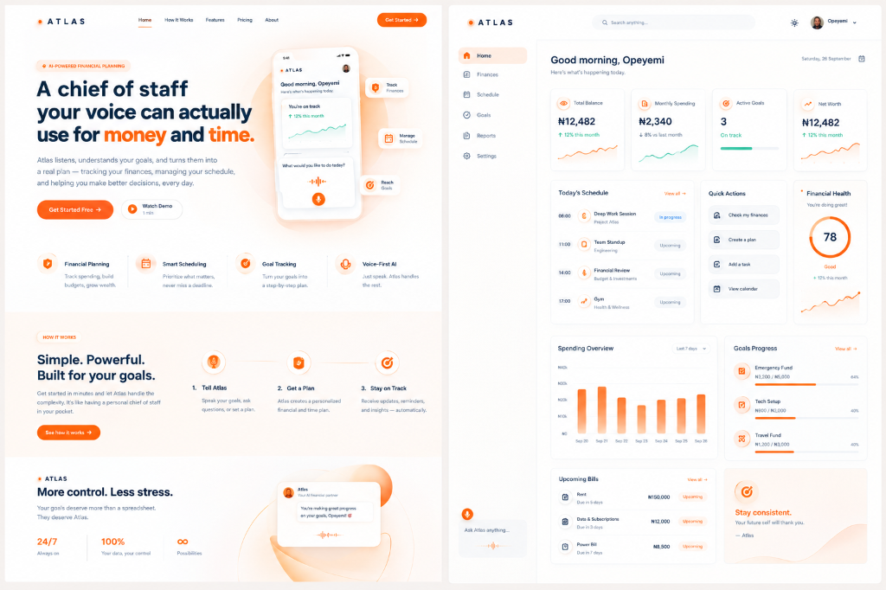
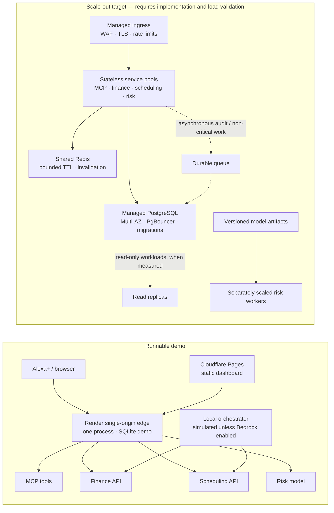

# ATLAS — Agentic Chief of Staff for Alexa+

Finance intelligence + academic/productivity scheduling, delivered as a self-hosted **MCP server** (Model Context Protocol, spec 2025-11-25+, Streamable HTTP transport) with a companion web command center dashboard.

Built as an Alexa+ self-hosted MCP experience, with an optional Bedrock
orchestrator and a companion dashboard for a user's **money** and **time**.

**Hackathon positioning:** primary track — Alexa+; mini-challenge candidates —
AWS Builder and Open Source. The MCP server is the primary Alexa+ integration;
the dashboard is a companion demo. See the demo and submission notes before
claiming any live Amazon integration.

---

## Visual Showcase



---

## What it does

| Voice intent | MCP tool | Backend |
|---|---|---|
| "Alexa, can I afford this?" | `assess_affordability` | finance-service → PyTorch risk model |
| "Alexa, what's my financial risk level today?" | `get_risk_snapshot` | finance-service → risk snapshots |
| "Alexa, I just spent X on Y — log it" | `log_transaction` | finance-service (append-only ledger) |
| "Alexa, plan my week around my exams" | `plan_study_week` | scheduling-service |
| "Alexa, commit that plan" | `commit_schedule` | scheduling-service (idempotent) |
| "Alexa, what's my day look like?" | `get_daily_brief` | finance + scheduling composition |

---

## System design and scale-out path

The diagram separates the **runnable demo** from the **scale-out target**. ATLAS
is not currently proven to serve millions of users: the Render blueprint runs a
single edge process with SQLite, and the AWS Terraform is a provisioning
starting point, not a tested high-availability deployment. No sub-10 ms or
million-user capacity claim is made. See [docs/architecture.md](docs/architecture.md)
for service boundaries, failure behavior, and production readiness gates.



### What is implemented today

- Services own their API and database access; the dashboard and MCP tools call
  them over HTTP. The edge gateway is a single-process deployment option, not
  a horizontally scalable gateway.
- Redis is optional. When configured, the finance cache uses a 1.5 s local L1
  plus Redis; same-key misses are coalesced per process. The process-local L1
  is not shared across replicas.
- Ledger writes and schedule commits accept idempotency keys. These protect
  retries, but million-user write safety still needs concurrent database tests
  and a production schema/unique-constraint review.
- The Docker Compose stack is for local multi-container development. Its
  Postgres service is a single container, not high availability.

### Gates before claiming million-user readiness

1. Deploy stateless service replicas behind managed ingress; keep SQLite and
   process-local state out of production.
2. Use managed, multi-zone PostgreSQL, migrations, connection pooling sized to
   database limits, and verify indexes/transaction isolation under realistic
   load before adding partitions or read replicas.
3. Make idempotency atomic at the database boundary; test concurrent retries,
   schedule conflicts, failover, and cache invalidation across replicas.
4. Add queue-backed processing only for work that can be asynchronous, with
   retries, dead-letter handling, and traceable delivery.
5. Establish SLOs, load-test representative read/write mixes, test recovery,
   and publish measured throughput/latency before capacity claims.

---

## Repository layout

```
atlas/
├── mcp-server/               # standalone, MIT-licensed MCP server package
├── services/
│   ├── common/               # atlas_common: shared DB models, config, connection pooling
│   ├── edge/                 # single-origin gateway: mounts all four apps behind one port
│   ├── risk-model/           # FastAPI + PyTorch risk model (/score)
│   ├── finance-service/      # ledger, affordability, risk snapshots (REST)
│   └── scheduling-service/   # deadlines, plan_study_week, commit_schedule (REST)
├── reasoning/
│   └── bedrock-orchestrator/ # Bedrock/AgentCore tool-selection + response drafting
├── dashboard/                # Next.js command center (Today / Money / Time / Agent Log)
├── infra/terraform/          # VPC, RDS, ECS/Fargate, ALB, Bedrock IAM
├── docker-compose.yml        # Production multi-container orchestration
├── render.yaml               # Render Blueprint for the single-origin backend
└── docs/                     # architecture.md, deployment.md, aws-integration.md, demo-script.md
```

---

## Local multi-container deployment (Docker Compose)

Run the stack locally for development. This Compose setup is not a
high-availability or million-user production deployment:

```bash
docker-compose up -d --build
```

Access services:
- **Dashboard**: `http://localhost:3000`
- **MCP Server**: `http://localhost:8003`
- **Finance Service**: `http://localhost:8001`
- **Scheduling Service**: `http://localhost:8002`
- **Risk Model Engine**: `http://localhost:8000`

---

## Demo data and product limits

The included `u_demo` profile and risk-model training data are synthetic. Risk
scores are an experimental demonstration, not validated financial advice,
credit scoring, or a recommendation to buy or borrow. The demo does not connect
to bank accounts, calendars, or an Alexa+ customer identity.

The hosted keyless demo intentionally exposes a shared synthetic profile and
disables MCP bearer auth so judges can try it without setup. Do not enter real
personal or financial data. Enabling MCP bearer auth alone does **not** secure
the dashboard or the finance/scheduling HTTP APIs; production needs a real
identity provider and authorization on every public API route.

---

## Cloud deploy (no API keys)

Backend on **Render**, dashboard on **Cloudflare Pages**, SQLite only. Full steps
in [docs/deployment.md](docs/deployment.md).

The backend is one service because all four backends share one SQLite file;
`services/edge` mounts them behind a single origin:

```powershell
# same shape as production, locally
$env:ATLAS_SEED_ON_START = "1"
python -m atlas_edge.asgi            # http://127.0.0.1:8000

# frontend, in a second terminal
cd dashboard
$env:NEXT_PUBLIC_ATLAS_URL = "http://127.0.0.1:8000"
npm run dev
```

| Path | Service |
|---|---|
| `/finance/*` | finance-service |
| `/schedule/*` | scheduling-service |
| `/risk/*` | risk-model |
| `/mcp/*` | MCP server (Streamable HTTP) |
| `/api/ask` | orchestrator (local rule-based router) |
| `/api/capabilities` | what is live vs simulated |

Bedrock is replaced by a local router that labels every reply `simulated: true`,
so the demo never claims an AWS call it did not make. Set `ATLAS_MOCK_BEDROCK=0`
with credentials to turn Bedrock back on.

---

## Quick start (Local Dev)

Recommended demo setup: one edge process mounts the services, with the
dashboard in a second process. From the repository root, install the backend:

```powershell
python -m pip install -e .\services\common -e .\services\edge `
  -e .\services\risk-model -e .\services\finance-service `
  -e .\services\scheduling-service -e ".\mcp-server[dev]" `
  -e .\reasoning\bedrock-orchestrator
```

Terminal 1:

```powershell
$env:ATLAS_DATABASE_URL = "sqlite:///./atlas_demo.db"
$env:ATLAS_REQUIRE_AUTH = "1"
$env:ATLAS_SEED_ON_START = "1"
$env:ATLAS_MOCK_BEDROCK = "1"
python -m atlas_edge.asgi
```

Terminal 2:

```powershell
cd dashboard
npm ci
$env:NEXT_PUBLIC_ATLAS_URL = "http://127.0.0.1:8000"
npm run dev
```

Open `http://localhost:3000`. To exercise all MCP tools, including duplicate
write retries, run `python scripts/demo_client.py` from a third terminal while
the backend is running.

---

## Verifying the core loop

For the complete live MCP integration suite, start the single-origin gateway
with an isolated database in one terminal:

```powershell
$env:ATLAS_DATABASE_URL = "sqlite:///./atlas_test.db"
$env:ATLAS_REQUIRE_AUTH = "1"
$env:ATLAS_SEED_ON_START = "0"
python -m atlas_edge.asgi
```

In a second terminal, run the Python suite against it. The live integration
test covers all six MCP tools, auth/identity enforcement, and write retries:

```powershell
$env:ATLAS_BASE_URL = "http://127.0.0.1:8000"
python -m pytest -q
```

Dashboard checks:

```powershell
cd dashboard
npm ci
npm run typecheck
npm run build
```

The integration tests skip when no running stack is reachable. Unit tests and
the dashboard build do not establish production capacity; load, failover, and
recovery tests are still required before making scale or availability claims.

---

## Submission alignment

- **Alexa+ track**: self-hosted MCP server, spec 2025-11-25+, Streamable HTTP, 6 typed tools.
- **AWS Builder mini-challenge**: `reasoning/bedrock-orchestrator` uses the boto3 Bedrock (`converse`) API for tool selection + response phrasing. Docs in `docs/aws-integration.md` and `infra/terraform/`.
- **Open Source mini-challenge**: `mcp-server/` is a standalone MIT-licensed package.

---

## License

MIT — see each package `LICENSE` and repository root `LICENSE`.