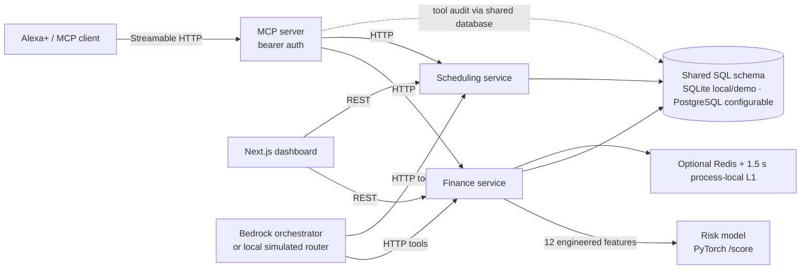

# ATLAS — architecture

> Agentic Chief of Staff for Alexa+. An MCP server plus a companion dashboard
> that handle the two things voice assistants are worst at: money judgment and
> finding time.

## 1. Why this shape

Three hard constraints shaped the design:

1. **The model is real.** Risk is scored by an actual PyTorch MLP inside its own
   FastAPI service. The MCP server never imports torch — it calls the model over
   HTTP, exactly like production.
2. **Voice retries must be safe.** Alexa+ sessions retry aggressively. Every
   write (`log_transaction`, `commit_schedule`) is idempotent-keyed at the
   service, so a replayed utterance cannot double-book or double-spend.
3. **Never trust a session id from the payload.** Identity comes from the bearer
   token at the transport, and every tool re-checks the caller-supplied
   `user_id` against the token's user before executing.

The dashboard reads the services over REST. The services own all reads/writes
(append-only ledger, snapshot history, audit log). **No database access exists
outside the services** — the MCP server and the dashboard are HTTP clients only.

The diagram shows service boundaries, not a claim of production scale. The
single-origin edge deployment mounts these apps in one process; Docker Compose
can run the APIs separately but supplies only a single Postgres container.
Million-user capacity, multi-zone failover, and latency targets have not been
load-tested or established. See the README's scale-out gates before making
capacity claims.

## 2. The six capabilities

| MCP tool                | Backend                  | Notes |
|-------------------------|--------------------------|-------|
| `assess_affordability`  | finance `POST /assess/affordability` | verdict safe/risky/blocked + risk delta, never persists the projection |
| `get_risk_snapshot`     | finance `GET /users/{id}/risk`       | live score + top factors |
| `log_transaction`       | finance `POST /transactions`         | idempotency-keyed |
| `plan_study_week`       | scheduling `POST /plan/week`         | greedy spaced study blocks, returns `proposed_blocks` |
| `commit_schedule`       | scheduling `POST /schedule/commit`   | idempotency-keyed, overlap-refused, reports conflicts |
| `get_daily_brief`       | finance + scheduling `brief`         | composes money + time into one speakable line |

Each tool is one small module under `mcp-server/src/atlas_mcp_server/tools/`.
Every call is timed and appended to `mcp_tool_calls` (Section 8.6 audit trail) —
the Agent Log screen reads these rows.

## 3. The risk engine

A supervised MLP (`RiskMLP`: 12 → 32 → 16 → 1, GELU, dropout) trained on
synthetic longitudinal accounts. Inputs are engineered from the ledger, not raw
amounts — utilization, income coverage, subscription load, cash-runway trend,
instability, etc. See `services/risk-model/app/features.py` for the full
contract.

Two design details that matter:

- **Explainability.** Scores are unpacked in gradient space:
  `impact(feature) = feature_value × ∂score/∂feature`, and the top contributors
  are surfaced as *"income utilization lowers risk (−0.07)"*. That fallback of
  trust is what lets Alexa+ answer "why".
- **Resilience.** Finance-service calls the model through a TTL cache (5 min
  live scores) + circuit breaker (5 straight failures → last-good snapshot for
  5 min). Hot reads use Redis when configured, with a 1.5 s process-local L1
  cache and same-key miss coalescing. Redis errors are logged and fall back to
  the local cache. A model that's down degrades the *freshness*, never the
  availability, of the answer.

Projections go through the model without being persisted (`persist=False`),
so "what if I buy this" never pollutes the score history.

## 4. The scheduler

Deadlines carry a weight; effort ≈ `2 + 2 × weight` hours. `plan_study_week`
lays 1.5 h blocks across the availability between *today* and each due time,
spaced so the work lands before the deadline instead of on it. `commit_schedule`
rejects overlaps against the existing calendar and returns them as `conflicts`,
with an idempotency key so voice retries never double-book.

## 5. Auth & identity

- Production defaults to fail-closed Cognito access-token verification (RS256,
  issuer, expiry, `token_use=access`, app-client ID, and JWKS signature).
- The browser uses OAuth authorization-code + PKCE and keeps the short-lived
  access token in memory. Cognito subject is the tenant identity; caller-supplied
  user IDs are checked against it on finance and scheduling routes, `/api/ask`,
  and MCP tools.
- The development token issuer and demo-seed routes are disabled unless
  `ATLAS_AUTH_MODE=dev` is explicitly selected. Do not use dev mode in a hosted
  environment.
- Schedule block updates are scoped to the authenticated owner.
- JWT verification alone does not establish production readiness. Configure
  Cognito callback/domain settings, protect browser clients against XSS, apply
  database migrations, and validate all deployment routes and dependencies.

## 6. SQLite → Postgres

Development runs on one SQLite file (`atlas.db`) shared by the services. The
same `atlas_common` models (SQLAlchemy) map 1:1 onto the Postgres DDL in
`services/common/atlas_common/schema.sql` (users, transactions with a
partition-ready pattern, risk_snapshots, deadlines, schedule_blocks,
auth_tokens, mcp_tool_calls). Set `ATLAS_DATABASE_URL` to a Postgres URL in
production and nothing else changes.

## 7. Operations

- **Observe:** `mcp_tool_calls` row per invocation; risk snapshots persisted per
  compute; `/health` on each service.
- **Idempotency:** ledger and calendar writes are keyed; replays are no-ops with
  a clear "already recorded" marker.
- **Deploy:** `infra/terraform` (RDS + ECS Fargate + Bedrock iam) and
  `docs/aws-integration.md` describe the server-side layout; `scripts/dev.ps1`
  restarts the whole local stack.